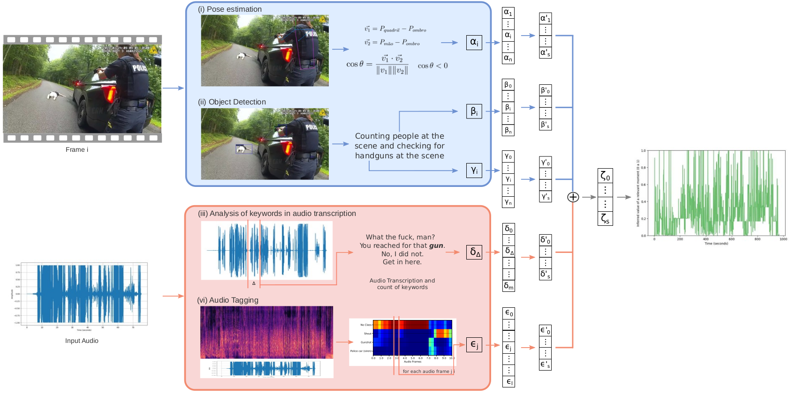

# Automatic Identification of Relevant Moments in Security Force Videos Using Multimodal Analysis


This repository contains the proposed method of the paper **[Automatic Identification of Relevant Moments in Security Force Videos Using Multimodal Analysis
]()** published at *Workshop on Computer Vision (WVC), 2024*.

We propose a multimodal approach to detect key moments in footage captured by wearable cameras used by law enforcement officers. Our method processes both video and audio separately, generating an inferred relevance score for each second on a scale from 0 to 1. A score of 0 indicates no significant activity, while a score of 1 denotes a highly relevant moment.

<p align="center">
  
</p>

If you find this code useful for your research, please cite the paper:

```bibtex
@inproceedings{silva2024,
    title        = {Automatic Identification of Relevant Moments in Security Force Videos Using Multimodal Analysis
},
    author       = {Ferreira, Luísa and Silva, Michel},
    year         = 2024,
    booktitle    = {Anais do XIX Workshop de Visão Computacional}, 
    location     = {Rio Paranaíba/MG},
    address      = {Rio Paranaíba, MG, Brasil}
    publisher    = {SBC}, 
    doi          = {}, 
    url          = {}, 
    note         = {to appear}
}
```

## Step by Step
For an input video, we perform four types of analysis to detect sounds and visual events that may indicate a relevant moment. Each analysis generates a JSON file with the processed data. Below, we explain how each step works and how to execute it.

### Pose estimation
We use pose estimation to detect human keypoints to verify if a person has their hands raised above shoulder level. To perform this analysis, run the `pose_estimation.py` script. Be sure to download the YOLOv8 pose estimation model.

```bash
python pose_estimation.py --save-video --input-video <path_to_input_video> --model_path <path_to_model> --output-folder <path_to_output_folder>
```

<ul> <li><code>--save-video</code>: Optional flag to save the output as a video file.</li> <li><code>--input-video</code>: Specify <code>&lt;path_to_input_video&gt;</code> as the path to the input video you want to analyze.</li> <li><code>--model_path</code>: Provide <code>&lt;path_to_model&gt;</code> as the path to the YOLO pose weights. You can download the model <a href="https://github.com/ultralytics/ultralytics?tab=readme-ov-file#models">here</a>.</li> <li><code>--output-folder</code>: Set <code>&lt;path_to_output_folder&gt;</code> as the directory where results should be saved. If unspecified, results are saved in the project directory by default.</li> </ul>


### Object Detection
We used a pre-trained network to detect handguns and people. Please refer to [CCTV-Gun](https://github.com/srikarym/CCTV-Gun) to get the model and weights. We used `Swin_Transformer_MGD_finetuned`. Execute the `object_detection.py` script as follows:

```bash
python object_detection.py --save-video --input-video <path_to_input_video> --model_path <path_to_model> --checkpoint-path <path_to_checkpoint> --output-folder <path_to_output_folder>
```
<ul> <li><code>--save-video</code>: Optional flag to save the output as a video file.</li> <li><code>--input-video</code>: Specify <code>&lt;path_to_input_video&gt;</code> as the path to the input video you want to analyze.</li> <li><code>--model_path</code>: Provide <code>&lt;path_to_model&gt;</code> as the path to the Python model file, which can be found <a href="https://github.com/srikarym/CCTV-Gun">here</a>.</li> <li><code>--checkpoint-path</code>: Provide <code>&lt;path_to_checkpoint&gt;</code> as the path to the model weights file, which can be found <a href="https://github.com/srikarym/CCTV-Gun">here</a>.</li> <li><code>--output-folder</code>: Set <code>&lt;path_to_output_folder&gt;</code> as the directory where results will be saved. If unspecified, results will be saved in the project directory by default.</li> </ul> 

If you encounter any issues with dependencies or libraries, please refer to the [CCTV-Gun](https://github.com/srikarym/CCTV-Gun) repository for detailed instructions on how to install all the necessary dependencies.


### Audio Transcription
We used a [faster whisper](https://github.com/SYSTRAN/faster-whisper) to transcript the audio. Execute `audio_transcription.py` script, we can choose your own keywords to set as relevant.

```bash
python audio_transcription.py --input-video <path_to_input_video> --output-folder <path_to_output_folder>
```
<li><code>--input-video</code>: Specify <code>&lt;path_to_input_video&gt;</code> as the path to the input video you want to analyze.</li> 
<li><code>--output-folder</code>: Set <code>&lt;path_to_output_folder&gt;</code> as the directory where results should be saved. If unspecified, results are saved in the project directory by default.</li> </ul> </details>

</details>

### Audio Events Detection

Download our fine tuned weights [here](). Execute `audioset.py`

```bash
python audioset.py --input-video <path_to_input_video> --model_path <path_to_model> --output-folder <path_to_output_folder>
```
<ul> <li><code>--input-video</code>: Specify <code>&lt;path_to_input_video&gt;</code> as the path to the input video you want to analyze.</li> <li><code>--model_path</code>: Provide <code>&lt;path_to_model&gt;</code> as the path to the model weights. You can download the model <a href="https://github.com/ultralytics/ultralytics?tab=readme-ov-file#models">here</a>.</li> <li><code>--output-folder</code>: Set <code>&lt;path_to_output_folder&gt;</code> as the directory where results should be saved. If unspecified, results are saved in the project directory by default.</li> </ul>


## Integrate Results

Each step mentioned earlier generates a JSON file, which will be saved in the `<output_folder>`. To generate the semantic profiles of your input video, execute `interpolation.py` as follows:

```bash
python interpolation.py --output-folder <path_to_output_folder>
```
<ul> <li><code>--output-folder</code>: Set <code>&lt;path_to_output_folder&gt;</code> as the directory where results will be saved. This directory should also contain all the previously processed data (in JSON files). If unspecified, results will be saved in the project directory by default.</li> </ul>
</details>


## Acknowledgments 
We would like to thank [Kong et al.](https://ieeexplore.ieee.org/abstract/document/9229505?casa_token=qi0jS41u2CcAAAAA:NntDUz11fgMFuTQUxWwOqJjO3r7mr6qTTJJrXcSnMqV4kXi9-lHRZ1oe4PBU5gGJEhFlq7sP9u5U) for providing the model and weights of PANNs for audio event detection. We also thank [Yellapragada et al.](https://arxiv.org/abs/2303.10703) for sharing their model and weights for detecting handguns and people. Additionally, we appreciate [@SYSTRAN](https://github.com/SYSTRAN) for releasing the reimplementation of Whisper, [faster-whisper](https://github.com/SYSTRAN/faster-whisper).


## Contact
### Authors
---


| [Luísa Ferreira](https://github.com/ferreiraluisa)  |[Michel Silva](https://michelmelosilva.github.io/) |
 :------------------------------------------------:  |:------------------------------------------------: |
|                 BSc. Student¹                  |      Assistant Professor¹                |
|          <luisa.ferreira@ufv.br>           |              <michel.m.silva@ufv.br>               |

¹Universidade Federal de Viçosa \
Departamento de Informática \
Viçosa, Minas Gerais, Brazil


---
### Laboratory

 | 
--- | ---


**MaVILab:** Machine Vision and Intelligence Laboratory
https://mavilab-ufv.github.io/


### Enjoy it! :smiley:
